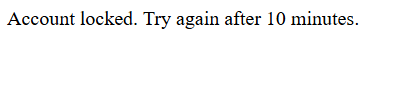

# 🔐 Secure Authentication System (Flask)

A secure user authentication system built using **Flask**, **SQLite**, **HTML**, and **CSS**, focusing on real-world security practices such as password hashing and login attempt protection.

---

## 🚀 Features

- User Registration & Login
- Password hashing using Werkzeug
- Session-based authentication
- Login attempt tracking
- Temporary account lock after multiple failed login attempts
- Automatic unlock after cooldown period
- Clean and simple UI
- SQLite database integration

---

## 🛡️ Security Highlights

- Passwords are never stored in plain text
- Failed login attempts are tracked
- Account is temporarily locked to prevent brute-force attacks
- Attempts reset after successful login or cooldown time

---

## 🛠️ Tech Stack

- **Backend:** Python, Flask  
- **Frontend:** HTML, CSS  
- **Database:** SQLite  
- **Security:** Werkzeug (password hashing)

---

## 📂 Project Structure

auth-system/
│── app.py
│── users.db (ignored via .gitignore)
│── requirements.txt
│── templates/
│ ├── login.html
│ ├── register.html
│ └── dashboard.html
│── static/CSS
│ └── style.css
│── screenshots/
│ ├── login.png
│ ├── error.png
│ └── dashboard.png
│── README.md
│── .gitignore


---

## 📸 Screenshots

### Login Page


### Invalid Login Attempt


### Dashboard


---

## ⚙️ How to Run Locally

1. Clone the repository
```bash
git clone https://github.com/your-username/auth-system.git
cd auth-system

Install dependencies
pip install -r requirements.txt

Run the application
python app.py

Open in browser
http://127.0.0.1:5000